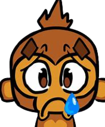

<h1 align="center">AdoptAndRaiseAMonkey</h1>

Raise a monkey and train it to become better and do loads of damage. p.s to restart the mod, you have to create a whole new game, restart button is bugged for some reason, and i aint finding a goofy ah harmony patch for it

